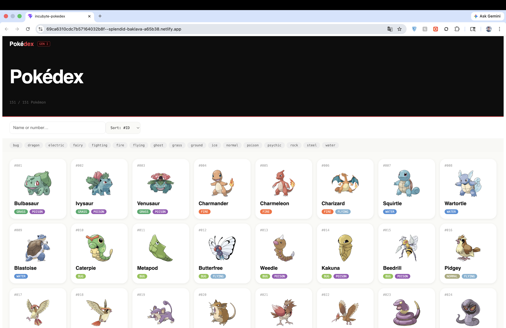
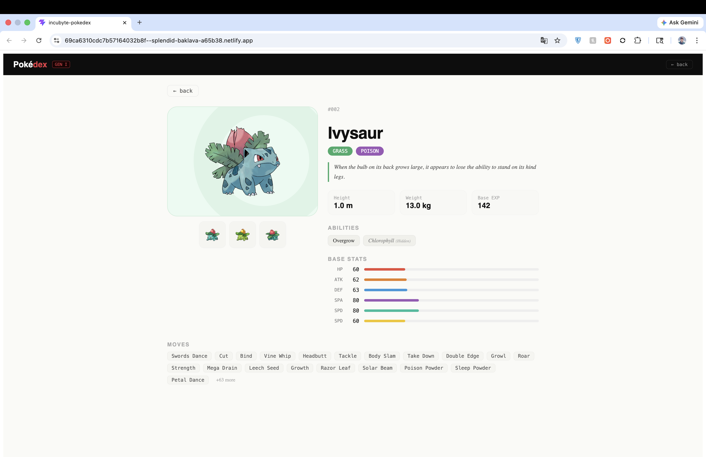
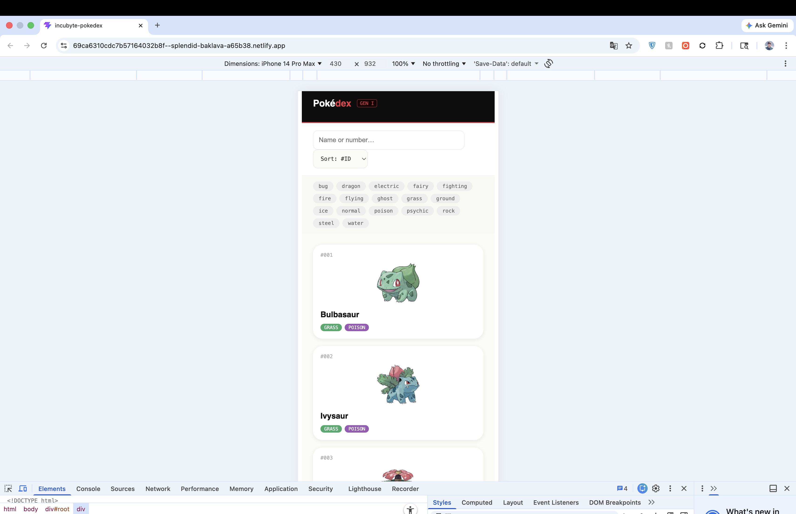

# Pokédex — Incubyte Frontend Engineering Kata

> A production-ready Pokémon browser built with React, TypeScript, and TDD.

🔗 **Live Demo → [Demo URL](https://69ca6310cdc7b57164032b8f--splendid-baklava-a65b38.netlify.app/)**



---

## Setup Instructions

### Prerequisites
- Node.js ≥ 18
- npm ≥ 9

### Install and run locally
```bash
git clone https://github.com/YOUR_GITHUB_USERNAME/incubyte-pokedex
cd incubyte-pokedex
npm install
npm run dev
# → http://localhost:5173
```

### Run tests
```bash
npm run test:run     # single pass
npm test             # watch mode
npm run coverage     # with coverage report
```

### Build for production
```bash
npm run build
```

---

## Features

| Feature | Details |
|---|---|
| Pokémon Listing | Grid of all 151 Gen I Pokémon from PokéAPI |
| Search | Filter by name (case-insensitive) or Pokédex number |
| Type Filters | Multi-select chips for all 18 types |
| Sort | By ID, Name, or HP |
| Skeleton Loading | Shimmer cards while data loads |
| Error State | User-friendly message on API failure |
| Detail Page | Sprite, flavor text, stats, abilities, moves |
| Responsive | Works on mobile, tablet, desktop |
| Accessible | Keyboard navigation, ARIA labels |

---

## Screenshots

| Listing | Detail | Mobile |
|---|---|---|
|  |  |  |

---

## Project Structure
```
src/
├── App.tsx                      # Root component, state management
├── types.ts                     # Shared TypeScript interfaces
├── api.ts                       # Fetch layer for PokéAPI
├── utils.ts                     # Pure utility functions
├── typeColors.ts                # Type → colour mapping
├── index.css                    # Global styles and keyframes
├── hooks/
│   ├── usePokemonList.ts        # Fetches and hydrates full list
│   └── usePokemonDetail.ts      # Fetches single Pokémon + species
├── components/
│   ├── Header.tsx
│   ├── PokemonCard.tsx
│   ├── CardSkeleton.tsx
│   ├── TypeBadge.tsx
│   ├── StatBar.tsx
│   └── DetailPage.tsx
└── __tests__/
    ├── utils.test.ts            # Unit tests — pure functions
    ├── typeColors.test.ts       # Unit tests — type colours
    ├── App.test.tsx             # Integration tests — user flows
    └── mocks/
        ├── handlers.ts          # MSW request handlers
        └── server.ts            # MSW node server
```

---

## TDD Workflow

This project follows strict **Red → Green → Refactor**.

Every feature was built in this cycle:
1. Write a failing test (RED commit)
2. Write the minimum code to pass it (GREEN commit)
3. Clean up without breaking tests (REFACTOR commit)

### Test stack
- **Vitest** — fast Vite-native test runner
- **React Testing Library** — user-centric queries, no implementation details
- **MSW (Mock Service Worker)** — intercepts fetch at network level, deterministic responses

### Test breakdown

| Suite | File | Focus |
|---|---|---|
| Unit | `utils.test.ts` | pad, capitalize, getFlavorText, getSprite |
| Unit | `typeColors.test.ts` | getTypeColor, all 18 types, fallback |
| Integration | `App.test.tsx` | Listing, search, filters, sort, errors, detail, accessibility |

---

## Architectural Decisions

### 1. No routing library
**Decision:** Simple `selected` state toggles between listing and detail views.

**Reason:** For a 2-page app with no deep-linking requirement, React Router adds ~50 KB for zero user-facing benefit. The state approach is simpler, easier to test, and perfectly adequate here.

### 2. Fetch all 151 Pokémon upfront
**Decision:** Fetch the list, then `Promise.all` for all 151 detail payloads in parallel.

**Reason:** PokéAPI's `/pokemon?limit=151` only returns names and URLs — not types. Type filtering on the listing page requires full detail data for every card. Parallel fetching completes in ~1–2 seconds which is acceptable for Gen I scope.

### 3. No external state management
**Decision:** `useState` + `useMemo` + `useCallback` only. No Redux or Zustand.

**Reason:** All state is local to two views with no cross-cutting concerns. A global store would add indirection with zero benefit at this scale.

### 4. Inline styles over CSS Modules or Tailwind
**Decision:** Inline styles with a consistent design token approach.

**Reason:** Zero build configuration, no class name collisions, styles co-located with components. The only downside — no media queries in inline styles — is handled via a single injected `<style>` tag in `index.css` for global keyframes.

### 5. TypeScript throughout
**Decision:** Strict TypeScript with explicit interfaces for all API shapes.

**Reason:** PokéAPI responses are complex and deeply nested. Typed interfaces catch integration bugs at compile time and make the codebase self-documenting.

---

## Trade-offs Made

| Decision | Trade-off |
|---|---|
| Fetch all 151 upfront | Faster filter UX at the cost of heavier initial network burst |
| No pagination | Simpler UX — would need virtual list for full 1000+ Pokédex |
| No URL routing | Can't deep-link to individual Pokémon detail pages |
| Inline styles | No CSS preprocessor features; harder to override from outside |
| Gen I only (151) | Focused scope — easy to extend with a limit/offset control |

---

## AI Usage Details

### Tools used
- **Claude (Anthropic)** — primary assistant throughout

### Where AI helped

| Area | How AI was used | Human decision |
|---|---|---|
| Component scaffolding | Generated initial JSX structure for PokemonCard, StatBar, DetailPage | Reviewed every prop, adjusted types and layout |
| Test case generation | Prompted for RTL + MSW integration tests covering edge cases | Added accessibility tests manually, fixed dependency arrays |
| Type colour palette | Generated hex values for all 18 Pokémon types | Adjusted contrast ratios for readability |
| Bug catching | Identified missing `sort` in useMemo dependency array | Fixed immediately before committing |
| README structure | Generated initial outline | Rewrote trade-offs and architectural rationale entirely |

### Key prompts used
```
"Generate a React hook usePokemonList that fetches Gen I list from 
pokeapi.co, hydrates each entry with full detail, and returns 
{ pokemon, loading, error }. Handle cancellation on unmount."

"Write Vitest + MSW tests for type filter multi-select: selecting 
fire shows only fire Pokémon, selecting fire+water shows both, 
clear resets to all."

"What are the trade-offs of fetching all 151 Pokémon in parallel 
vs paginating with lazy detail loads?"
```

### Rationale
AI accelerated scaffolding and test generation — work that is largely mechanical and repetitive. All architectural decisions, trade-off analysis, TDD sequencing, and debugging were done by the developer. Every AI-generated snippet was read, understood, tested, and often modified before committing.

---

## Live Demo

🔗 [Demo URL](https://69ca6310cdc7b57164032b8f--splendid-baklava-a65b38.netlify.app/)